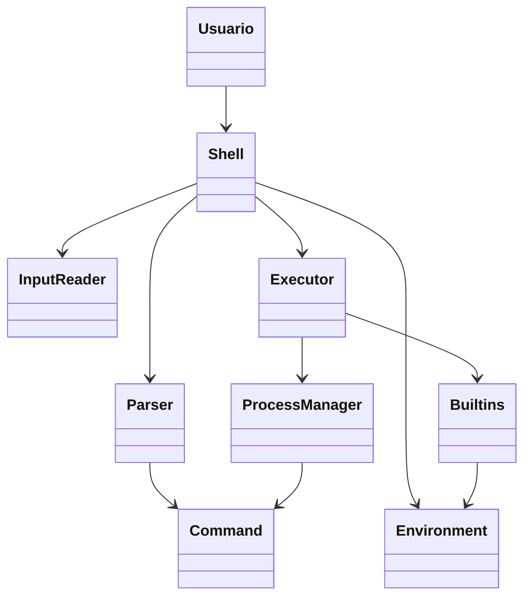

# Casos de uso e UML

## Visão geral

Esta seção apresenta a modelagem inicial do comportamento do shell e a estrutura conceitual dos módulos principais. O objetivo é ilustrar como os usuários interagem com o sistema e como as responsabilidades são distribuídas entre os componentes.

---

## Diagrama UML da arquitetura inicial

### Descrição dos elementos

- `Usuario`: pessoa que interage com o shell no terminal.
- `Shell`: componente central do sistema, responsável por coordenar a execução.
- `InputReader`: lê o texto digitado pelo usuário.
- `Parser`: transforma a linha em tokens e estrutura de comando.
- `Command`: representa o comando e seus argumentos.
- `Executor`: decide entre execução de builtins ou programas externos.
- `Builtins`: mantém os comandos internos do shell.
- `ProcessManager`: gere processos filhos e supervisão da execução.
- `Environment`: armazena estado atual do shell.

---

## Casos de uso principais

### UC-01: Executar um comando externo

**Ator principal:** Usuário

**Descrição:** O usuário informa um comando do sistema, como `ls`, `pwd` ou `echo`.

**Fluxo principal:**

1. usuário informa o comando;
2. shell lê a entrada;
3. parser separa os argumentos;
4. executor identifica o comando como externo;
5. shell cria um processo filho;
6. processo executa o programa solicitado;
7. shell aguarda o término e volta ao prompt.

**Resultado esperado:**

- comando executado com sucesso;
- saída exibida corretamente no terminal;
- shell retorna ao estado de espera.

---

### UC-02: Executar um comando interno

**Ator principal:** Usuário

**Descrição:** O usuário executa um comando interno do shell, como `cd`, `exit` ou `help`.

**Fluxo principal:**

1. usuário informa o comando interno;
2. shell identifica o builtin;
3. executor despacha para a rotina correspondente;
4. estado do shell é atualizado;
5. sistema retorna ao prompt.

**Resultado esperado:**

- comando interno é processado sem depender de `fork`;
- alteração de estado ou fechamento do shell ocorre corretamente.

---

### UC-03: Alterar diretório atual

**Ator principal:** Usuário

**Descrição:** O usuário usa `cd` para navegar entre diretórios.

**Fluxo principal:**

1. usuário executa `cd <caminho>`;
2. shell reconhece o builtin `cd`;
3. diretório atual do processo é atualizado;
4. prompt é reexibido no novo contexto.

**Resultado esperado:**

- mudança de diretório confirmada;
- próximas execuções usam o diretório correto.

---

### UC-04: Encerrar o shell

**Ator principal:** Usuário

**Descrição:** O usuário opta por sair do shell usando `exit`.

**Fluxo principal:**

1. usuário digita `exit`;
2. shell identifica o comando interno;
3. aplicação finaliza corretamente.

**Resultado esperado:**

- processo do shell encerra sem falhas de encerramento.

---

### UC-05: Tratar comando inválido

**Ator principal:** Usuário

**Descrição:** O usuário informa um comando inexistente.

**Fluxo principal:**

1. usuário digita um comando inválido;
2. shell tenta executá-lo como externo;
3. sistema retorna erro;
4. shell exibe mensagem adequada;
5. retorna ao estado de espera.

**Resultado esperado:**

- mensagem de erro clara e legível;
- shell não encerra após falha do comando.

---

## Regras de negócio iniciais

- todo comando deve ser lido em uma linha de entrada;
- entrada vazia não deve causar erro crítico;
- comandos internos têm prioridade sobre executáveis externos;
- falhas de execução devem ser reportadas sem encerrar a aplicação;
- shell deve permanecer em loop até que o usuário execute `exit`.

---

## Conclusão

Os casos de uso e o diagrama UML mostram a visão de arquitetura inicial do projeto, permitindo entender como o sistema se comporta, quais módulos são necessários e como as funcionalidades principais serão integradas no shell.
