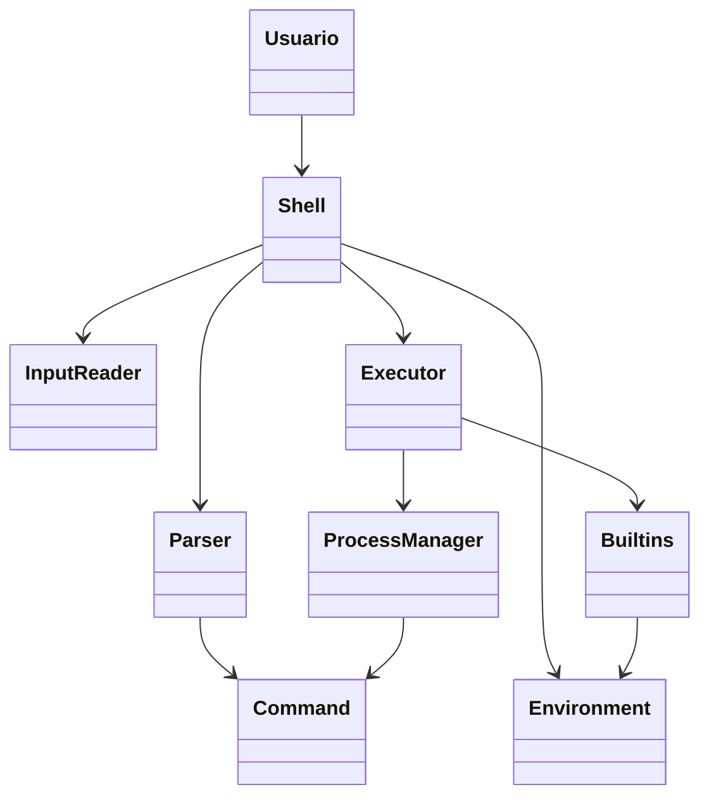

# Casos de uso e UML

## 1. Objetivo

Esta seção apresenta a visão comportamental e estrutural da primeira versão do `simpleBash`, permitindo compreender o fluxo de interação do usuário com o sistema e a organização dos principais módulos do shell.

---

## 2. Diagrama de classes / arquitetura conceitual

### Descrição dos componentes

- `Usuario`: interage com o shell por meio do terminal.
- `Shell`: gerencia o ciclo de vida do programa e coordena as operações.
- `InputReader`: lê a entrada do usuário.
- `Parser`: interpreta os comandos e argumentos.
- `Command`: representa a estrutura do comando a ser executado.
- `Executor`: decide o tipo de execução a ser realizado.
- `Builtins`: contém os comandos internos do shell.
- `ProcessManager`: controla subprocessos e execução externa.
- `Environment`: mantém estado do shell e contexto de execução.

---

## 3. Casos de uso principais

### UC-01: Executar comando externo

**Ator:** Usuário

**Descrição:** O usuário digita um comando do sistema operacional, como `ls`, `pwd` ou `echo`.

**Fluxo principal:**
1. usuário digita o comando;
2. shell lê a linha;
3. parser separa os tokens;
4. executor identifica comando externo;
5. processo filho é criado;
6. comando é executado;
7. retorno do processo é exibido;
8. shell volta ao prompt.

**Critério de aceite:**
- execução bem-sucedida do comando externo;
- retorno visível no terminal;
- prompt reaparece sem travamentos.

---

### UC-02: Executar comando interno

**Ator:** Usuário

**Descrição:** O usuário informa um comando interno do shell, como `cd`, `exit` ou `pwd`.

**Fluxo principal:**
1. usuário digita o comando;
2. shell reconhece o builtin;
3. executor chama rotina correspondente;
4. estado do shell é atualizado ou aplicação é encerrada;
5. sistema retorna ao prompt.

**Critério de aceite:**
- builtin realiza a operação esperada;
- shell continua funcionando corretamente após o comando.

---

### UC-03: Alterar diretório

**Ator:** Usuário

**Descrição:** O usuário usa `cd` para mudar de diretório.

**Fluxo principal:**
1. usuário digita `cd <diretório>`;
2. shell identifica o builtin;
3. diretório atual é alterado;
4. prompt passa a refletir o novo contexto.

**Critério de aceite:**
- diretório atual muda de forma consistente;
- próximos comandos são executados a partir do novo diretório.

---

### UC-04: Encerrar o shell

**Ator:** Usuário

**Descrição:** O usuário solicita o encerramento do programa com `exit`.

**Fluxo principal:**
1. usuário digita `exit`;
2. shell reconhece o comando interno;
3. aplicação finaliza corretamente.

**Critério de aceite:**
- programa encerra sem falhas e sem processamento pendente.

---

### UC-05: Tratar comando inválido

**Ator:** Usuário

**Descrição:** O usuário informa um comando inexistente ou inválido.

**Fluxo principal:**
1. usuário digita comando inválido;
2. sistema tenta executar como processo externo;
3. falha é detectada;
4. mensagem de erro é exibida;
5. shell retorna ao prompt.

**Critério de aceite:**
- mensagem clara é exibida;
- aplicação não é encerrada por causa da falha.

---

## 4. Regras de negócio iniciais

- toda entrada do usuário deve ser lida em uma linha de comando;
- entrada vazia não deve resultar em falha crítica;
- comandos internos têm prioridade sobre executáveis externos;
- falhas devem ser reportadas sem interromper a interface do shell;
- o shell deve permanecer ativo até `exit`.

---

## 5. Conclusão

A modelagem de casos de uso e a estrutura UML ajudam a visualizar o comportamento esperado da aplicação e facilitam a implementação inicial do projeto. Isso também garante que o código seja organizado em módulos com responsabilidades bem definidas.
