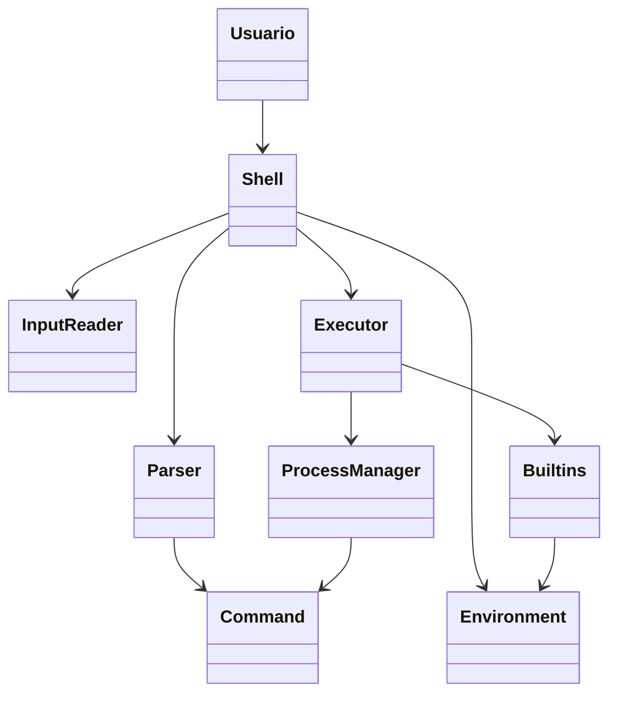

# Arquitetura inicial do simpleBash

## Visão geral

O projeto `simpleBash` é um shell em linguagem C com foco em estudo e em uma implementação mínima, mas organizada. A ideia central é manter um loop principal de leitura e execução de comandos, com estruturas separadas para entrada, parsing, execução e gestão de processos.

A arquitetura proposta busca ser simples e didática, com módulos bem definidos para facilitar evolução futura.

---

## Objetivos da arquitetura

- Ler comandos digitados no terminal;
- interpretar tokens e operadores básicos;
- executar comandos internos ou externos;
- gerenciar processos filho via `fork`/`exec`;
- manter uma base fácil de ampliar com builtins, redirecionamento e pipeline.

---

## Estrutura conceitual

### 1. Loop principal do shell

O shell roda em um laço infinito:

1. exibe o prompt;
2. lê a linha digitada pelo usuário;
3. valida a entrada;
4. separa os comandos e argumentos;
5. executa o comando;
6. aguarda a finalização do processo;
7. repete.

Responsável por coordenar o ciclo de vida do shell.

---

### 2. Módulo de entrada

Funções relacionadas à leitura da linha de comando.

Responsabilidades:

- leitura de entrada via `getline` ou `fgets`;
- remoção de quebra de linha;
- validação de entrada vazia;
- armazenagem temporária da linha digitada.

Este módulo é o ponto de entrada para toda a lógica do shell.

---

### 3. Módulo de parsing

Responsável por transformar a linha em uma estrutura de comando.

Exemplo de estrutura de dados:

```c
typedef struct {
    char **argv;      // argumentos do comando
    int argc;         // quantidade de argumentos
    char *input_file;
    char *output_file;
    int append_mode;
    int background;
} Command;
```

Responsabilidades:

- separar a linha em tokens;
- reconhecer operadores simples (`>`, `>>`, `|`, `&`);
- montar a estrutura `Command`;
- preparar a execução do comando.

A etapa de parsing deve ser simples e incremental, inicialmente sem suporte a expansão complexa de shell.

---

### 4. Módulo de execução

Depois do parsing, o shell decide como executar o comando.

#### 4.1 Comandos internos

Alguns comandos podem ser executados diretamente no processo do shell, como:

- `cd`
- `exit`
- `help`
- `pwd`
- `echo` (se desejar, conforme a evolução do projeto)

Esses comandos geralmente modificam o estado do shell e não exigem `fork`.

#### 4.2 Comandos externos

Para programas externos, o shell usa `fork()` para criar um processo filho e `execvp()` para executar o programa.

Fluxo:

```text
shell
  -> fork()
      -> processo filho
          -> execvp(argv[0], argv)
      -> processo pai
          -> waitpid()
```

Esse mecanismo permite que o shell execute programas do sistema operacional sem necessariamente implementar cada comando manualmente.

---

### 5. Módulo de builtins

Representa a camada de comandos do próprio shell.

Exemplo de funções:

- `builtin_cd()`
- `builtin_exit()`
- `builtin_help()`
- `builtin_pwd()`

A organização típica é:

```c
int execute_builtin(char **argv);
int is_builtin(char *command);
```

Esse módulo centraliza as operações que dependem do estado do shell, como mudança de diretório ou encerramento da aplicação.

---

### 6. Módulo de gerenciamento de processos

Aqui ficam os cuidados com a criação, supervisão e finalização dos processos.

Responsabilidades:

- criar processos filhos;
- controlar status de execução;
- tratar `SIGINT`, `SIGTERM` e sinais relevantes;
- gerenciar comandos em segundo plano, se implementados.

Esse módulo garante que o shell supervise corretamente o ciclo de vida dos comandos executados.

---

### 7. Módulo de ambiente e estado do shell

O shell precisa manter alguns dados do estado atual, por exemplo:

- diretório atual;
- variável de ambiente;
- nome do shell;
- status do último comando;
- estrutura de histórico, se desejado.

Essa camada deve concentrar as variáveis globais ou uma estrutura `ShellState`.

Exemplo:

```c
typedef struct {
    char *current_dir;
    char **envp;
    int last_status;
} ShellState;
```

---

### 8. Módulo de I/O e apresentação

Responsável pela interação com o usuário.

Funções incluem:

- exibir prompt;
- imprimir mensagens de erro;
- formatar saída de comandos internos;
- exibir retorno de execução do processo.

A separação dessa camada evita misturar lógica de interface com lógica de processamento.

---

## Fluxo geral de execução

```text
+----------------------+
| Usuário digita       |
| comando no terminal  |
+----------+-----------+
           |
           v
+----------------------+
| Leitura da linha     |
+----------+-----------+
           |
           v
+----------------------+
| Parsing da entrada   |
+----------+-----------+
           |
           v
+----------------------+
| Decisão de execução  |
| builtin ou externo   |
+----------+-----------+
           |
           v
+----------------------+
| Execução do comando  |
+----------+-----------+
           |
           v
+----------------------+
| Espera / retorno     |
+----------------------+
```

---

## UML da arquitetura inicial

A estrutura do sistema pode ser representada em um diagrama de classes/arquitetura conceitual, destacando as relações entre o usuário, o shell e os módulos internos.



### Interpretação do diagrama

- `Usuario` interage com o shell pelo terminal;
- `Shell` coordena o ciclo principal do programa;
- `InputReader` lê e valida a linha digitada;
- `Parser` transforma a entrada em tokens/comandos;
- `Command` representa a estrutura do comando a ser executado;
- `Executor` decide se usa builtin ou processo externo;
- `Builtins` concentra os comandos internos do shell;
- `ProcessManager` cria e supervisiona os processos filho;
- `Environment` mantém o estado atual do shell.

---

## Casos de uso

### 1. Executar um comando externo

**Ator:** Usuário

**Descrição:** O usuário digita um comando do sistema, como `ls` ou `pwd`, e o shell o executa.

**Fluxo principal:**

1. usuário digita o comando;
2. shell lê a entrada;
3. parser separa os argumentos;
4. executor identifica o comando como externo;
5. cria um processo filho;
6. executa o programa via `execvp`;
7. espera a finalização e retorna ao prompt.

---

### 2. Executar um comando interno

**Ator:** Usuário

**Descrição:** O usuário utiliza um comando do shell, como `cd`, `exit` ou `help`.

**Fluxo principal:**

1. usuário digita o builtin;
2. shell interpreta o comando;
3. executor resolve a operação interna;
4. shell atualiza seu estado ou encerra a execução;
5. retorna ao prompt.

---

### 3. Alterar diretório

**Ator:** Usuário

**Descrição:** O usuário executa `cd` para trocar o diretório atual.

**Fluxo principal:**

1. usuário digita `cd <caminho>`;
2. shell identifica o builtin `cd`;
3. código altera o diretório atual do processo;
4. sistema atualiza o estado do shell;
5. prompt passa a ser exibido no novo diretório.

---

### 4. Encerrar o shell

**Ator:** Usuário

**Descrição:** O usuário solicita a saída do shell através do comando `exit`.

**Fluxo principal:**

1. usuário digita `exit`;
2. shell identifica o builtin;
3. processo principal encerra corretamente;
4. aplicação termina.

---

### 5. Tratar comando inválido

**Ator:** Usuário

**Descrição:** Quando o usuário digita um comando inexistente.

**Fluxo principal:**

1. usuário digita um comando que não existe;
2. shell tenta executá-lo como programa externo;
3. `execvp` falha;
4. shell exibe uma mensagem de erro;
5. retorna ao prompt sem interromper a execução.

---

## Organização inicial sugerida dos arquivos

```text
project/
├── include/
│   ├── shell.h
│   ├── parser.h
│   ├── executor.h
│   └── builtins.h
├── src/
│   ├── main.c
│   ├── shell.c
│   ├── parser.c
│   ├── executor.c
│   ├── builtins.c
│   └── utils.c
├── Makefile
└── README.md
```

Essa divisão facilita a manutenção e deixa claro o papel de cada parte do shell.

---

## Escopo inicial

Para a primeira versão do projeto, o foco deve ser em:

- prompt simples;
- leitura de uma linha por vez;
- tokenização básica;
- execução de programas externos via `fork`/`exec`;
- suporte a `cd`, `exit` e `pwd`;
- tratamento básico de erros.

A partir daí, a evolução pode incluir:

- redirecionamento de entrada/saída;
- pipes;
- histórico de comandos;
- expansão de variáveis;
- controle de sinais;
- suporte a scripts.

---

## Conclusão

A arquitetura inicial do `simpleBash` deve priorizar clareza e didática. O shell pode ser implementado em camadas bem definidas: leitura, parsing, execução e supervisão de processos. Isso torna o projeto mais fácil de entender, testar e evoluir conforme o aprendizado em C e em sistemas operacionais.

This file defines the initial architecture for the shell project and can be extended as the implementation grows.

- execução de programas externos via `fork`/`exec`;
- suporte a `cd`, `exit` e `pwd`;
- tratamento básico de erros.

A partir daí, a evolução pode incluir:

- redirecionamento de entrada/saída;
- pipes;
- histórico de comandos;
- expansão de variáveis;
- controle de sinais;
- suporte a scripts.

---

## Conclusão

A arquitetura inicial do `simpleBash` deve priorizar clareza e didática. O shell pode ser implementado em camadas bem definidas: leitura, parsing, execução e supervisão de processos. Isso torna o projeto mais fácil de entender, testar e evoluir conforme o aprendizado em C e em sistemas operacionais.
